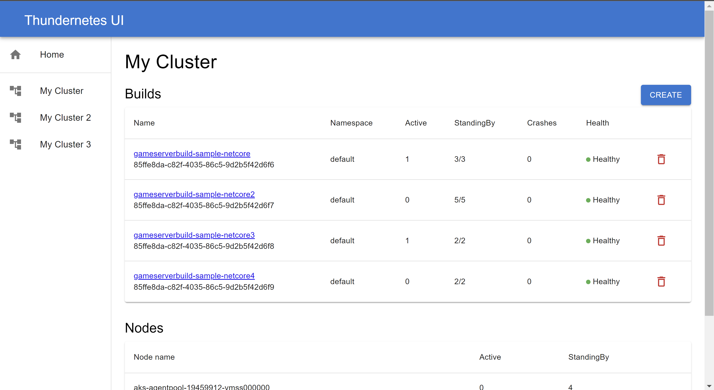
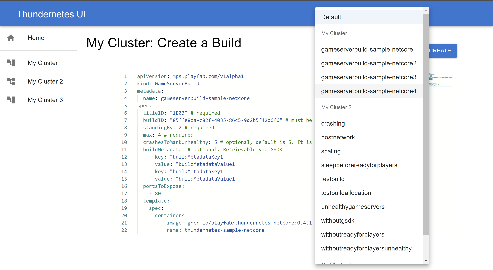
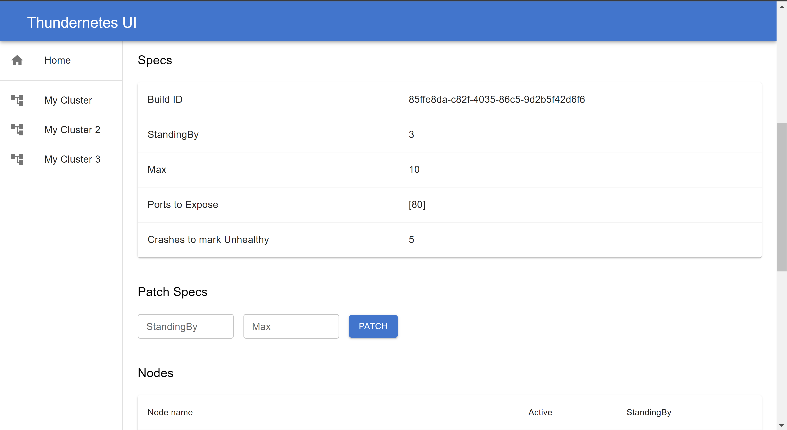
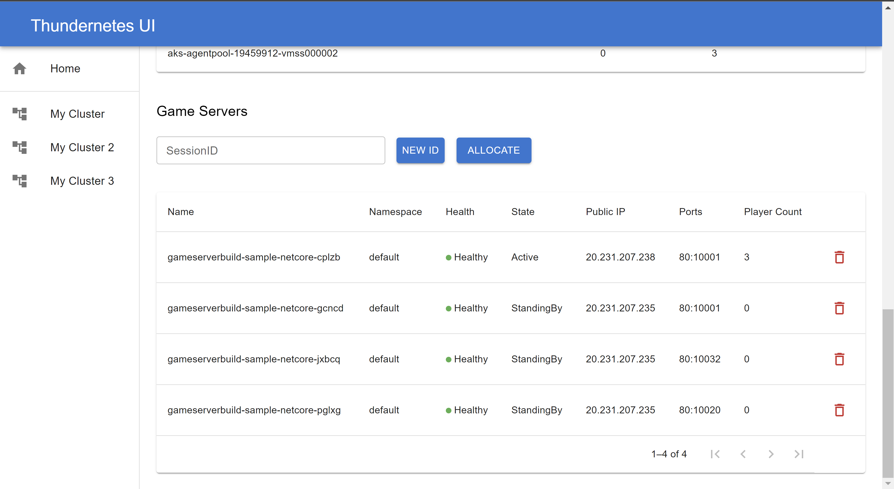

# Thundernetes UI

This project is a front end application to manage game servers running in one or more [Thundernetes](https://github.com/PlayFab/thundernetes) clusters. To be able to connect to them, be sure to deploy the [GameServer API](https://github.com/PlayFab/thundernetes/tree/main/cmd/gameserverapi) on each cluster.

Make sure to check [the documentation on the Thundernetes website](https://playfab.github.io/thundernetes/thundernetesui/README.html) for more details!

## How to use

### How to config the app
The app needs a file called ```config.js``` with the endpoints to the GameServer API and to the Thundernetes manager (this is only to allocate game servers). Inside the file you need to define a variable called ```clusters``` with the following structure:

```js
var clusters = {
  "cluster1": {
    "api": "http://{cluster1_api_IP}:5001/api/v1/",
    "allocate": "http://{cluster1_manager_IP}:5000/api/v1/allocate"
  },
  "cluster2": {
    "api": "http://{cluster2_api_IP}:5001/api/v1/",
    "allocate": "http://{cluster2_manager_IP}:5000/api/v1/allocate"
  }
}
 ```

### How to run locally
If you want to run the project locally, first you need to install [Node.js](https://nodejs.org/en/download/). Then clone the project:

```
git clone https://github.com/PlayFab/thundernetes-ui.git
```

And install the dependencies:

```
npm install
```

After this, you can create the ```config.js``` file inside the public folder, then you can simply run the app with the ```npm start``` command. This will start a server and open a browser to ```http://localhost:3000```.

### How to run using the Docker image

You can also run the Docker container image, all you have to do is mount a volume to pass your ```config.js``` file to the app, you can do this like this:

```
docker run -d -p 80:80 -v [path to your config.js]:/usr/share/nginx/html/config.js ghcr.io/playfab/thundernetes-ui:[current tag]
```

## Features

### Check all of your clusters in the same place

You can see a summary of what's going on in all your clusters.


### Manage the builds on each cluster

Check the builds you have on each cluster and their current status. You can also create a new one, either from scratch, or by cloning one from any cluster!





### Manage each build

You can check each build separately and see it's status and specs, you can modify the standingBy and max values, allocate individual game servers for testing, and see a list of all the game servers running.




